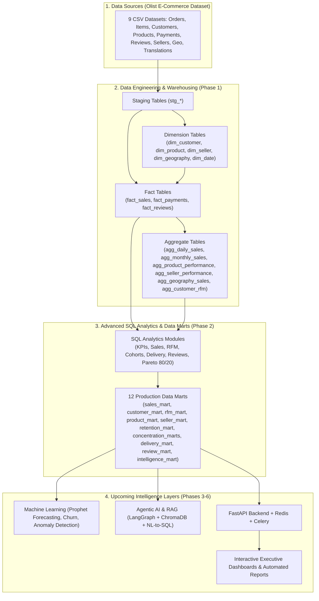

# 🚀 AI-Powered Sales Intelligence Platform

An enterprise-grade, end-to-end **AI-Powered Sales Intelligence Platform** that integrates modern Data Engineering, Star-Schema Data Warehousing, Advanced SQL Analytics, Machine Learning, Agentic AI, Retrieval-Augmented Generation (RAG), and Production APIs into a unified decision-support ecosystem.

---

## 📌 Project Status: Completed Milestones & Roadmap

| Phase | Description | Status |
| :--- | :--- | :--- |
| **Phase 1: Data Engineering & Warehousing** | MySQL 8.4 container, raw data ingestion, dimensional modeling (Star Schema: 5 Dims, 3 Facts, 6 Aggregates), and validation notebooks | <kbd>✅ COMPLETED</kbd> |
| **Phase 2: Business Analytics & SQL Intelligence** | 12 modular SQL intelligence modules, RFM segmentation, cohort retention, Pareto (80/20) analysis, and 12 analytical data marts | <kbd>✅ COMPLETED</kbd> |
| **Phase 3: Machine Learning & Predictive Analytics** | 5 production ML pipelines: Churn Prediction, CLV Regression, Sales Forecasting, Seller Risk Scoring, Product Recommendations | <kbd>✅ COMPLETED</kbd> |
| **Phase 4: Agentic AI & RAG System** | LangGraph multi-agent orchestration, Dual-Collection ChromaDB RAG, SQL security sandbox, KPI engine, autonomous RCA, and evidence provenance audit trail | <kbd>✅ COMPLETED</kbd> |
| **Phase 5: Backend API & Async Processing** | Production FastAPI REST endpoints, JWT/RBAC security, Redis caching with in-memory fallback, and Celery asynchronous task queues | <kbd>✅ COMPLETED</kbd> |
| **Phase 6: Interactive BI & Executive Dashboards** | Dark-mode Streamlit BI Command Center, ML Scenario Simulators, Agentic AI Copilot, and automated PDF & Excel Executive Briefing Books | <kbd>✅ COMPLETED</kbd> |

---

## 📖 System Architecture & Overview



---

## 🛠️ Technology Stack

- **Database & Storage**: MySQL 8.4 (Dockerized), SQLAlchemy 2.0, PyMySQL
- **Data Engineering**: Python 3.13, Pandas 3.0, Pandera, UV Package Manager
- **SQL & Analytics**: Advanced MySQL (CTEs, Window Functions `NTILE`, `DENSE_RANK`, Date Mathematics, Aggregations)
- **Validation & Notebooks**: Jupyter, Plotly, Matplotlib
- **Machine Learning (Upcoming)**: Scikit-learn, Prophet, Statsmodels, SciPy
- **AI & RAG (Upcoming)**: LangChain, LangGraph, ChromaDB, LangSmith, OpenAI APIs
- **Backend & Async (Upcoming)**: FastAPI, Uvicorn, Pydantic v2, Redis, Celery
- **DevOps & Tooling**: Docker Compose, Ruff, Black, Pytest

---

## 📂 Project Structure

```text
AI-Powered Sales Intelligence Platform/
├── docker-compose.yml                     # Containerized MySQL 8.4 service
├── pyproject.toml                         # Modern UV dependency specifications
├── requirements.txt                       # Locked dependencies
├── .env.example                           # Environment configuration template
│
├── data/
│   └── raw/                               # 9 Raw Olist Brazilian E-Commerce CSVs
│       ├── olist_customers_dataset.csv
│       ├── olist_geolocation_dataset.csv
│       ├── olist_order_items_dataset.csv
│       ├── olist_order_payments_dataset.csv
│       ├── olist_order_reviews_dataset.csv
│       ├── olist_orders_dataset.csv
│       ├── olist_products_dataset.csv
│       ├── olist_sellers_dataset.csv
│       └── product_category_name_translation.csv
│
├── src/
│   ├── ingestion/
│   │   ├── database.py                    # Database connection factory & engine pooling
│   │   └── load_staging.py                # Automated staging ETL loader (all 9 tables)
│   │
│   └── Transformation/
│       ├── buid_dimmension.py             # Dimension table builder (SCD / upserts)
│       ├── build_fact_sales.py            # Primary sales fact table builder
│       ├── build_fact_payments.py         # Financial & payment transactions fact builder
│       ├── build_fact_reviews.py          # Customer review sentiment fact builder
│       └── build_aggregates.py            # High-performance analytical aggregates builder
│
├── business_analytics_sql/
│   ├── 01_kpi_definitions.sql             # Executive formulas & benchmark definitions
│   ├── 02_core_sales_metrics.sql          # Revenue, volume, AOV, item velocity
│   ├── 03_customer_metrics.sql          # LTV, repeat buyer rates, acquisition metrics
│   ├── 04_product_metrics.sql           # Category performance, catalog revenue share
│   ├── 05_seller_metrics.sql            # Seller fulfillment, volume & rating distributions
│   ├── 06_geography_metrics.sql         # Regional demand vs supply, interstate logistics
│   ├── 07_delivery_metrics.sql          # Delivery lead times, delays, logistics variance
│   ├── 08_review_metrics.sql            # Review score distributions & delivery correlations
│   ├── 09_rfm_analysis.sql              # NTILE(5) Recency, Frequency, Monetary segmentation
│   ├── 10_cohort_analysis.sql           # Monthly acquisition cohort retention matrices
│   ├── 11_sales_intelligence.sql        # Pareto (80/20) concentration & growth analytics
│   ├── 12_create_data_marts.sql         # 12 Production Analytical Data Mart tables
│   └── validate.sql                     # Fast database consistency & row check script
│
└── Notebook/
    ├── 1-dataexplore.ipynb                # Raw dataset profiling & initial exploratory data analysis
    ├── 2-dimension.ipynb                  # Dimension table structure & integrity verification
    ├── 3-fact_validation.ipynb            # Fact tables grain & surrogate key validation
    └── 04_aggregate_validation.ipynb      # Aggregate tables correctness & KPI sanity tests
```

---

## 🔍 Detailed Implementation Breakdown (What Has Been Built)

### 1. Data Ingestion & Staging
- Automated batch loading of raw e-commerce CSV files into MySQL staging tables with schema inference, date parsing, and batch execution.
- Handles 1M+ geolocation coordinates and 100K+ transactional records.

### 2. Star-Schema Data Warehouse Architecture
- **Dimensions (`dim_*`)**:
  - `dim_customer`: Unique customer profiles, location prefixes, cities, and states.
  - `dim_product`: Product dimensions, weights, and English-translated categories.
  - `dim_seller`: Merchant profiles and operational locations.
  - `dim_geography`: Cleaned geographic centroids (latitude/longitude averages per ZIP prefix).
  - `dim_date`: Complete calendar dimension with year, quarter, month, day name, week of year, and weekend flags.
- **Facts (`fact_*`)**:
  - `fact_sales`: Granular order-item grain containing revenue, freight, delivery tracking metrics, surrogate foreign keys, and delay indicators.
  - `fact_payments`: Sequential transaction records, payment types, installments, and values.
  - `fact_reviews`: Review ratings, response times, and customer satisfaction metrics.
- **Aggregates (`agg_*`)**:
  - `agg_daily_sales` & `agg_monthly_sales`: Fast pre-aggregated metrics for executive dashboards.
  - `agg_product_performance` & `agg_seller_performance`: Entity-level unit volumes, revenue, and delivery latency metrics.
  - `agg_geography_sales`: State-level demand vs. fulfillment flows.
  - `agg_customer_rfm`: Customer behavioral metrics.

### 3. Business Analytics & SQL Intelligence Layer
- **RFM Customer Segmentation**: Uses SQL `NTILE(5)` window functions to score Recency, Frequency, and Monetary metrics, classifying customers into actionable segments (e.g., *Champions*, *Loyal Customers*, *At Risk*, *Lost*).
- **Cohort Retention Analysis**: Tracks customer retention rates across monthly acquisition cohorts to measure lifetime engagement.
- **Pareto Concentration (80/20 Rule)**: Identifies revenue concentration across top customers, top product categories, and top sellers using cumulative window functions.
- **12 Production Data Marts**:
  1. `sales_mart` — Daily order volume, revenue, freight, and AOV trends.
  2. `customer_mart` — Customer lifetime days, order frequency, and customer classifications.
  3. `rfm_mart` — Granular RFM scores and customer segment assignments.
  4. `product_mart` — Product sales velocity, revenue, and pricing metrics.
  5. `seller_mart` — Merchant sales volume, order counts, and revenue contribution.
  6. `retention_mart` — Cohort month-over-month active retention rates.
  7. `customer_concentration_mart` — Cumulative revenue rank for customers (Top 10% flag).
  8. `product_concentration_mart` — Cumulative revenue rank for products (Top 20% flag).
  9. `seller_concentration_mart` — Cumulative revenue rank for sellers (Top 10% flag).
  10. `delivery_mart` — Order fulfillment status, delivery days, and delay patterns.
  11. `review_mart` — Customer sentiment score breakdown and ratings distribution.
  12. `sales_intelligence_mart` — Executive business intelligence summary KPIs.

---

## 🚀 Getting Started

### 1. Prerequisites
- Python 3.13+
- [uv](https://github.com/astral-sh/uv) (recommended) or standard `pip`
- Docker & Docker Compose

### 2. Environment Configuration
Copy the `.env.example` file and configure your environment variables:

```bash
cp .env.example .env
```

Ensure your `.env` contains:
```env
MYSQL_HOST=localhost
MYSQL_PORT=3306
MYSQL_DATABASE=sales_intelligence
MYSQL_USER=vikash
MYSQL_PASSWORD=your_password
```

### 3. Start Database Service
```bash
docker compose up -d
```

### 4. Install Dependencies
Using `uv`:
```bash
uv sync
```
Or using `pip`:
```bash
pip install -r requirements.txt
```

### 5. Run the End-to-End ETL Pipeline

1. **Load Raw Data to Staging**:
   ```bash
   python src/ingestion/load_staging.py
   ```

2. **Build Dimension Tables**:
   ```bash
   python src/Transformation/buid_dimmension.py
   ```

3. **Build Fact Tables**:
   ```bash
   python src/Transformation/build_fact_sales.py
   python src/Transformation/build_fact_payments.py
   python src/Transformation/build_fact_reviews.py
   ```

4. **Build Aggregate Tables**:
   ```bash
   python src/Transformation/build_aggregates.py
   ```

5. **Generate Analytical Data Marts**:
   Execute the SQL scripts in `business_analytics_sql/` or load `12_create_data_marts.sql` directly into MySQL:
   ```bash
   mysql -u vikash -p sales_intelligence < business_analytics_sql/12_create_data_marts.sql
   ```

---

## 🔮 Upcoming Phases & Next Steps

1. **Machine Learning Pipeline (Phase 3)**:
   - Prophet time-series models for daily and monthly sales forecasting.
   - Logistic regression / Random Forest models for customer churn prediction.
   - Statistical and ML-based anomaly detection on order volume and delivery delays.
2. **Agentic AI & RAG Layer (Phase 4)**:
   - LangGraph-powered conversational agent capable of querying MySQL data marts using natural language.
   - ChromaDB vector store indexing business definitions, SQL documentation, and contextual metadata.
   - Root-cause analysis engine that explains *why* sales dropped or grew.
3. **Production API & UI (Phases 5 & 6)**:
   - FastAPI endpoints for metrics, forecasts, and AI chat.
   - Celery & Redis background workers for heavy analytics jobs.
   - Executive dashboard UI with real-time charting and reporting.