# 🚀 AI-Powered Sales Intelligence Platform

[](https://www.python.org/)
[](https://www.mysql.com/)
[](https://fastapi.tiangolo.com/)
[](https://streamlit.io/)
[](https://langchain-ai.github.io/langgraph/)
[](https://www.trychroma.com/)
[](https://scikit-learn.org/)
[-brightgreen.svg)]()
[](https://github.com/astral-sh/ruff)

An enterprise-grade, end-to-end **AI-Powered Sales Intelligence & Decision-Support Platform**. It unifies modern **Data Engineering & Warehousing**, **Advanced SQL Business Analytics**, **Production Machine Learning**, **Agentic AI & Retrieval-Augmented Generation (RAG)**, **High-Performance FastAPI REST Backends**, and an **Executive Streamlit BI Command Center** with automated PDF & Excel briefing generation.

---

## 📌 Executive Architecture & Highlights

```mermaid
flowchart TD
    subgraph DataSources ["1. Raw Ingestion Layer (Olist E-Commerce)"]
        CSV["9 Raw Datasets (Orders, Items, Customers, Products, Payments, Reviews, Sellers, Geo, Translations)"]
    end

    subgraph DataWarehouse ["2. Data Engineering & Warehousing (MySQL 8.4)"]
        Staging["Staging Tables (stg_*)"]
        Dimensions["Star-Schema Dimensions\n(dim_customer, dim_product, dim_seller, dim_geography, dim_date)"]
        Facts["Fact Tables\n(fact_sales, fact_payments, fact_reviews)"]
        Aggregates["Pre-Calculated Aggregates\n(agg_daily_sales, agg_monthly_sales, agg_product_performance, agg_seller_performance, agg_geography_sales, agg_customer_rfm)"]
    end

    subgraph AnalyticsMarts ["3. Advanced SQL Analytics & 12 Data Marts"]
        Marts["12 Production Data Marts\n(sales_mart, customer_mart, rfm_mart, product_mart, seller_mart, retention_mart, concentration_marts, delivery_mart, review_mart, sales_intelligence_mart)"]
    end

    subgraph ML_Layer ["4. Production Machine Learning Suite"]
        ML_Delay["Logistics Delay Classifier\n(HistGBM: 79.5% Acc, 0.759 AUC)"]
        ML_Forecast["Sales Forecaster\n(Multi-Lag Ridge: R² = 0.708)"]
        ML_Recs["Cross-Sell Recommender\n(Item-Item Cosine Similarity)"]
        ML_NLP["Sentiment & CSAT Classifier\n(TF-IDF + LogReg: 93.3% Acc, 0.978 AUC)"]
    end

    subgraph Agentic_RAG ["5. Agentic AI, RAG & Security Governance"]
        Supervisor["LangGraph Supervisor Orchestrator"]
        NL_SQL["Self-Healing Text-to-SQL Agent"]
        KPI_Engine["Deterministic KPI Calculation Engine"]
        RCA_Agent["Autonomous Root-Cause Diagnostic Agent"]
        ChromaRAG["Dual-Collection ChromaDB RAG\n(schema_catalog & business_knowledge)"]
        Guards["SQLGuard AST Filter + PromptGuard Injection Defense"]
        Audit["Verifiable Provenance Audit Trail Tracker"]
    end

    subgraph Presentation_API ["6. Production API, UI & Executive Briefings"]
        FastAPI["FastAPI REST Backend (JWT / RBAC / Redis Caching)"]
        Streamlit["Executive Streamlit BI Command Center (7 Pages)"]
        Reports["Automated ReportLab PDF & Multi-Tab Excel Briefing Generator"]
    end

    CSV --> Staging
    Staging --> Dimensions & Facts
    Dimensions & Facts --> Aggregates
    Aggregates & Facts --> Marts
    Marts --> ML_Layer & Agentic_RAG
    ML_Layer --> Agentic_RAG
    Agentic_RAG --> FastAPI & Streamlit
    FastAPI --> Streamlit & Reports
```



---

## 🌟 Key Platform Capabilities

| Capability Domain | Technical Implementation | Business Impact |
| :--- | :--- | :--- |
| **Data Warehousing** | MySQL 8.4 Star Schema (5 Dimensions, 3 Facts, 6 Analytical Aggregates) | Sub-second analytical queries across 100K+ historical e-commerce transactions. |
| **SQL Business Intelligence** | 12 Production Data Marts, `NTILE(5)` RFM Segmentation, Cohort Retention Matrices, Pareto (80/20) Analysis | Instant 360° visibility into revenue concentration, customer lifetime value, and merchant performance. |
| **Predictive ML Engines** | 4 Clean Production Models (Delivery Delay Risk, Multi-Horizon Sales Forecaster, Product Cross-Sell Recommender, Review NLP) | Proactive fulfillment risk prevention, forward revenue visibility, and automated CSAT sentiment routing. |
| **Agentic AI & RAG** | LangGraph Multi-Agent Supervisor, Dual-Collection ChromaDB Vector Store, Self-Healing SQL generator, Autonomous Root-Cause Analysis | Empowers non-technical executives to query data marts, run ML predictions, and diagnose metric drops in plain English. |
| **Enterprise Security & Governance** | SQLGuard AST-based SQL query sanitizer, PromptGuard prompt-injection blocker, Verifiable Provenance Audit Trail | Guarantees zero SQL injection, enforces read-only warehouse access, and records verifiable evidence logs for every AI answer. |
| **REST API & BI Command Center** | FastAPI REST endpoints with JWT/RBAC security, Redis caching with in-memory fallback, 7-page Dark Mode Streamlit UI | Provides low-latency REST APIs for external integration and an interactive executive cockpit. |
| **Automated Executive Briefings** | ReportLab PDF Briefing Books + openpyxl Styled Multi-Tab Excel Workbooks | One-click generation of board-ready performance summaries and operational spreadsheets. |

---

## 🏗️ Detailed Architectural Milestones

### 1. Data Engineering & Warehousing (Phase 1)
- **Automated Ingestion Pipeline**: Ingests 9 raw Brazilian E-Commerce CSV datasets (orders, items, customers, products, payments, reviews, sellers, geolocation, category translations) into structured MySQL staging tables.
- **Star Schema Architecture**:
  - `dim_customer`: Unique customer UUIDs, ZIP prefixes, cities, and states.
  - `dim_product`: Cleaned product dimensions, weights, and English translated categories.
  - `dim_seller`: Merchant profiles and operational locations.
  - `dim_geography`: Cleaned geographic centroids (latitude/longitude averages per ZIP).
  - `dim_date`: Complete calendar dimension with year, quarter, month, day name, week of year, and weekend flags.
- **Granular Fact Tables**:
  - `fact_sales`: Order-item grain with prices, freight, delivery tracking metrics, delay flags, and surrogate foreign keys.
  - `fact_payments`: Sequential transaction records, payment methods, installments, and values.
  - `fact_reviews`: Review satisfaction scores, response times, and customer comments.
- **High-Performance Aggregates**:
  - `agg_daily_sales`, `agg_monthly_sales`, `agg_product_performance`, `agg_seller_performance`, `agg_geography_sales`, `agg_customer_rfm`.

### 2. Advanced SQL Analytics & 12 Data Marts (Phase 2)
The platform compiles 12 specialized production data marts via modular analytical SQL:
1. `sales_mart`: Daily order volumes, revenue, freight, and Average Order Value (AOV).
2. `customer_mart`: Customer lifetime span, repeat order frequency, and acquisition metrics.
3. `rfm_mart`: `NTILE(5)` Recency, Frequency, and Monetary scores mapped to customer tiers (*Champions*, *Loyalists*, *At Risk*, *Lost*).
4. `product_mart`: Product sales velocity, catalog revenue share, and unit volumes.
5. `seller_mart`: Merchant fulfillment volume, order counts, and revenue contribution.
6. `retention_mart`: Monthly acquisition cohort retention matrices.
7. `customer_concentration_mart`: Pareto cumulative customer revenue ranking (Top 10% flag).
8. `product_concentration_mart`: Pareto cumulative product revenue ranking (Top 20% flag).
9. `seller_concentration_mart`: Pareto cumulative merchant revenue ranking (Top 10% flag).
10. `delivery_mart`: Logistics fulfillment status, lead times, and SLA delay distributions.
11. `review_mart`: Customer satisfaction ratings, response times, and sentiment distributions.
12. `sales_intelligence_mart`: Executive business intelligence summary KPIs.

### 3. Production Machine Learning Suite (Phase 3)
Four high-accuracy, production-grade ML pipelines trained on the analytical data marts:

| Model Pipeline | Algorithm | Primary Metrics | Key Features | Business Value |
| :--- | :--- | :--- | :--- | :--- |
| **1. Delivery Delay Predictor** | `HistGradientBoostingClassifier` | **ROC-AUC: `0.7588`**<br>Accuracy: `79.53%`<br>Delay Recall: `55.12%` | Freight ratio, package weight/dimensions, seller historical delay rate, interstate route | Predicts delivery delay probability *at checkout* to alert logistics teams. |
| **2. Sales & Revenue Forecaster** | `RidgeRegressor` (Multi-Lag) | **$R^2$: `0.7081`**<br>MAE: `$6,259.06$`<br>RMSE: `$7,701.24$` | Autoregressive lags ($t-1 \dots t-30$), rolling 7/14/30-day stats, day-of-week & month | Delivers recursive forward 30/60/90-day revenue projections with 95% confidence bounds. |
| **3. Product Recommendation Engine** | `Sparse Item-Item Cosine Similarity` | **Coverage: `100%`**<br>Item Rules: `1,199`<br>Categories: `73` | Co-occurrence transaction matrix with popularity fallbacks | Suggests complementary items to boost cart conversion and Average Order Value (AOV). |
| **4. Review Sentiment NLP Classifier** | `TF-IDF + LogisticRegression` | **Accuracy: `93.31%`**<br>F1-Score: `0.8942`<br>ROC-AUC: `0.9784`<br>Recall: `94.51%` | Sublinear TF-IDF n-grams with Portuguese stopword normalization | Detects negative customer sentiment in real time, auto-routing urgent complaints to support. |

### 4. Agentic AI, RAG & Security Governance (Phase 4)
- **LangGraph Multi-Agent Supervisor**: Intelligently routes queries across specialized sub-agents:
  - **Self-Healing Text-to-SQL Agent**: Converts natural language into valid MySQL 8.4 queries with automated error recovery.
  - **KPI Intelligence Engine**: Directly executes verified deterministic mathematical formulas for executive KPIs.
  - **Autonomous Root-Cause Analysis (RCA) Agent**: Decomposes performance anomalies across monthly revenue trends, product category contractions, and interstate logistics bottlenecks.
  - **Predictive ML Agent**: Triggers live inference across delay, forecasting, recommendation, and sentiment pipelines.
  - **Hybrid Multi-Agent Workflow**: Chains RCA diagnostics with forward sales forecasting and cross-sell recovery recommendations.
- **Dual-Collection ChromaDB RAG**:
  - `schema_catalog`: Indexes technical DDL, column types, grains, and join paths for Text-to-SQL retrieval.
  - `business_knowledge`: Indexes executive KPI formulas, SLAs, RFM definitions, and operational policies.
- **Enterprise Guardrails & Security**:
  - `SQLGuard`: AST-based query validator enforcing read-only `SELECT` / `WITH` execution, row limit clamping, and prevention of destructive commands (`DROP`, `DELETE`, `UPDATE`, `INSERT`, `TRUNCATE`, `ALTER`, `GRANT`).
  - `PromptGuard`: Sanitizes user inputs to neutralize prompt injection and jailbreak attempts.
  - `ProvenanceTracker`: Attaches verifiable evidence logs (SQL executed, tables queried, ML models invoked, execution latency) to every response.

### 5. Production FastAPI Backend (Phase 5)
- **REST Endpoints**: Comprehensive OpenAPI/Swagger documented routes for Authentication, KPI Calculations, Analytics Data Marts, ML Predictions, Agent Workflows, PDF/Excel Reports, and System Health.
- **Security & RBAC**: JWT Bearer tokens with Role-Based Access Control (`admin`, `analyst`, `viewer`).
- **Caching & Async Queues**: Redis caching with transparent in-memory fallback and background task simulation.

### 6. Executive Streamlit BI Command Center (Phase 6)
An interactive, dark-themed Streamlit application with 7 dedicated modules:
1. **Executive Overview**: High-level KPIs, revenue run-rates, and sales velocity charts.
2. **Customer & RFM Analytics**: RFM segment distributions, customer lifetime value, and cohort retention heatmap.
3. **Logistics & Delivery SLAs**: Interstate transit times, carrier delay hotspots, and SLA compliance metrics.
4. **ML Predictive Simulators**: Interactive sandbox to test delay risk, forward forecasts, basket cross-sells, and sentiment.
5. **AI Agent Copilot**: Conversational interface with multi-agent orchestration and expandable Provenance Audit Drawers.
6. **Report Exports**: One-click generation and direct download of executive PDF and Excel briefing books.
7. **System Health & Telemetry**: Real-time database pooling status, Redis cache hit rates, and vector store metrics.

---

## 📂 Repository Directory Layout

```text
AI-Powered Sales Intelligence Platform/
├── docker-compose.yml                     # Containerized MySQL 8.4 & Redis 7 services
├── pyproject.toml                         # Project metadata and UV package dependencies
├── requirements.txt                       # Locked dependencies
├── .env.example                           # Template for environment configuration
├── chat.py                                # Interactive Terminal AI Agent Console
├── test_db.py                             # Database connection & sanity verification script
│
├── data/
│   └── raw/                               # 9 Raw Olist Brazilian E-Commerce CSVs
│
├── src/
│   ├── ingestion/
│   │   ├── database.py                    # Thread-safe SQLAlchemy connection pool
│   │   └── load_staging.py                # Automated staging ETL loader (all 9 tables)
│   │
│   ├── Transformation/
│   │   ├── buid_dimmension.py             # Star-schema dimension builders (SCD / upserts)
│   │   ├── build_fact_sales.py            # Primary sales fact table builder
│   │   ├── build_fact_payments.py         # Financial & payments fact builder
│   │   ├── build_fact_reviews.py          # Customer review sentiment fact builder
│   │   └── build_aggregates.py            # Analytical aggregate tables builder
│   │
│   ├── agents/                            # LangGraph Multi-Agent Orchestration
│   │   ├── supervisor.py                  # StateGraph supervisor & hybrid workflow DAG
│   │   ├── nl_sql_agent.py                # Self-healing Schema-aware Text-to-SQL agent
│   │   ├── kpi_engine.py                  # Deterministic mathematical KPI calculator
│   │   ├── rca_agent.py                   # Autonomous Root Cause Analysis engine
│   │   ├── llm_factory.py                 # Multi-provider factory (Groq, OpenAI, Mock LLM)
│   │   ├── state.py                       # LangGraph AgentState definitions
│   │   └── tools/                         # Modular tools for SQL, ML, and RCA variance
│   │
│   ├── rag/                               # Dual-Collection Vector Store & Knowledge Base
│   │   ├── vector_store.py                # ChromaDB manager (schema_catalog & business_knowledge)
│   │   ├── schema_knowledge.py            # DDL definitions, table grains, and join paths
│   │   └── business_knowledge.py          # Domain KPIs, SLA rules, and RFM definitions
│   │
│   ├── security/                          # Security & Governance Guardrails
│   │   ├── sql_guard.py                   # AST-level SQL validation & read-only enforcement
│   │   └── prompt_guard.py                # Adversarial prompt injection sanitizer
│   │
│   ├── provenance/                        # Audit Trail & Lineage
│   │   └── tracker.py                     # Verifiable provenance evidence recorder
│   │
│   ├── api/                               # Production FastAPI REST Backend
│   │   ├── main.py                        # FastAPI application entry point
│   │   ├── config.py                      # Application settings & environment loader
│   │   ├── dependencies.py                # Auth dependencies & database sessions
│   │   ├── cache.py                       # Redis caching client with in-memory fallback
│   │   ├── auth/                          # JWT token generation & password hashing
│   │   ├── schemas/                       # Pydantic v2 request/response schemas
│   │   ├── v1/endpoints/                  # Modular endpoints (kpis, analytics, ml, agents, reports)
│   │   └── workers/                       # Async task dispatchers & celery queues
│   │
│   ├── dashboard/                         # Executive Streamlit BI Command Center
│   │   ├── app.py                         # Multi-page Streamlit application entry point
│   │   ├── theme.py                       # Premium dark-mode design system & tokens
│   │   ├── api_client.py                  # Robust REST API client with fallback
│   │   ├── components/                    # Reusable UI widgets (KPI cards, charts, drawers)
│   │   └── pages/                         # 7 Interactive analytics & simulation pages
│   │
│   └── reporting/                         # Executive Briefing Book Engines
│       ├── pdf_generator.py               # ReportLab PDF executive briefing compiler
│       └── excel_generator.py             # openpyxl styled multi-tab Excel generator
│
├── ml/                                    # Production Machine Learning Suite
│   ├── common/                            # Reusable DB pool, data loaders, preprocessors
│   ├── delivery_delay/                    # 1. Logistics SLA & Delivery Delay Predictor
│   ├── forecasting/                       # 2. Multi-Horizon Sales Forecaster
│   ├── recommendation/                    # 3. Cross-Sell Recommendation Engine
│   └── review_sentiment/                  # 4. Review Sentiment NLP Classifier
│
├── business_analytics_sql/                # 12 Modular SQL Analytics & Data Mart scripts
│   ├── 01_kpi_definitions.sql
│   ├── ...
│   ├── 11_sales_intelligence.sql
│   ├── 12_create_data_marts.sql           # Schema DDL for all 12 production data marts
│   └── validate.sql
│
├── tests/                                 # Comprehensive Pytest Suite (80 Tests, 100% Pass)
└── Notebook/                              # Validation and exploratory Jupyter notebooks
```

---

## ⚡ Quickstart Guide

### 1. Prerequisites
- **Python**: `3.13+`
- **Docker**: Docker Desktop / Docker Engine
- **Package Manager**: [uv](https://github.com/astral-sh/uv) (recommended) or standard `pip`

---

### 2. Environment Setup

Clone the repository and create your `.env` configuration:

```bash
cp .env.example .env
```

Configure your `.env` file:
```env
APP_ENV=development

# MySQL 8.4 Configuration
MYSQL_HOST=localhost
MYSQL_PORT=3306
MYSQL_DATABASE=sales_intelligence
MYSQL_USER=vikash
MYSQL_PASSWORD=vikash@7014

# LLM API Keys (Groq or OpenAI)
GROQ_API_KEY=your_groq_api_key_here
OPENAI_API_KEY=your_openai_api_key_here
```

---

### 3. Start Database & Cache Containers

Start the containerized MySQL and Redis instances:
```bash
docker compose up -d mysql redis
```
*(Verify container status using `docker ps`)*

---

### 4. Install Dependencies

Using **UV** (fastest):
```bash
uv sync
.venv\Scripts\Activate.ps1
```

Or using **Pip**:
```bash
python -m venv .venv
.venv\Scripts\Activate.ps1
pip install -r requirements.txt
```

---

### 5. Run the ETL & Data Mart Pipeline

Execute the automated data engineering pipeline in order:

```bash
# 1. Ingest raw CSVs into MySQL staging tables
python src/ingestion/load_staging.py

# 2. Build Star-Schema Dimension tables
python src/Transformation/buid_dimmension.py

# 3. Build Fact tables
python src/Transformation/build_fact_sales.py
python src/Transformation/build_fact_payments.py
python src/Transformation/build_fact_reviews.py

# 4. Build Analytical Aggregates
python src/Transformation/build_aggregates.py

# 5. Build 12 Production Data Marts (SQL)
# Execute business_analytics_sql/12_create_data_marts.sql in MySQL
```

---

### 6. Launch Applications

#### **Option A: Streamlit BI Command Center (Web UI)**
```bash
streamlit run src/dashboard/app.py --server.port 8501
```
👉 Open **[http://localhost:8501](http://localhost:8501)** in your browser.

#### **Option B: FastAPI REST Backend (API Docs)**
```bash
uvicorn src.api.main:app --reload --port 8000
```
👉 Open Swagger UI at **[http://localhost:8000/docs](http://localhost:8000/docs)**.

#### **Option C: Interactive AI Agent Terminal**
```bash
python chat.py
```
*(Interactive conversational prompt supporting Text-to-SQL, ML predictions, and RCA anomaly diagnostics)*

---

## 📡 REST API Documentation

The FastAPI backend exposes fully typed REST endpoints with OpenAPI/Swagger documentation:

| Endpoint | Method | Description | Auth Required |
| :--- | :---: | :--- | :---: |
| `/api/v1/auth/login` | `POST` | Authenticate user and issue JWT token | No |
| `/api/v1/auth/register` | `POST` | Register a new platform user | No |
| `/api/v1/auth/me` | `GET` | Retrieve current user profile and role | Yes |
| `/api/v1/kpis/overview` | `GET` | Executive revenue, order volume, and AOV metrics | Yes |
| `/api/v1/kpis/customer-economics` | `GET` | Customer repeat rates and average LTV | Yes |
| `/api/v1/kpis/logistics-sla` | `GET` | Delivery delay rate and transit day averages | Yes |
| `/api/v1/kpis/rfm-segments` | `GET` | Customer RFM segment counts and metrics | Yes |
| `/api/v1/kpis/top-categories` | `GET` | Top revenue product category breakdown | Yes |
| `/api/v1/analytics/marts/sales` | `GET` | Paginated daily sales data mart records | Yes |
| `/api/v1/analytics/marts/delivery` | `GET` | Fulfillment status and delivery SLA data mart | Yes |
| `/api/v1/analytics/marts/products` | `GET` | Product sales velocity and revenue data mart | Yes |
| `/api/v1/analytics/marts/sellers` | `GET` | Merchant performance and ratings data mart | Yes |
| `/api/v1/analytics/marts/reviews` | `GET` | Review score breakdown and sentiment data mart | Yes |
| `/api/v1/ml/predict-delay` | `POST` | Predict delivery delay risk for a shipment | Yes |
| `/api/v1/ml/forecast-sales` | `POST` | Generate 30/60/90-day recursive sales forecast | Yes |
| `/api/v1/ml/recommend-products` | `POST` | Get cross-sell product recommendations | Yes |
| `/api/v1/ml/analyze-sentiment` | `POST` | Classify customer review sentiment and urgent complaints | Yes |
| `/api/v1/agents/chat` | `POST` | Execute LangGraph multi-agent conversational inquiry | Yes |
| `/api/v1/reports/briefing/pdf` | `GET` | Download compiled Executive PDF Briefing Book | Yes |
| `/api/v1/reports/briefing/excel` | `GET` | Download multi-tab styled Excel Workbook | Yes |
| `/api/v1/tasks/rca-async` | `POST` | Dispatch asynchronous background RCA task | Yes |
| `/api/v1/health` | `GET` | Health check & dependency readiness probe | No |

---

## 🔒 Security, Safety & Audit Lineage

1. **SQLGuard AST Sanitizer**:
   - Parses every dynamically generated SQL query using `sqlglot`.
   - Strictly enforces read-only access (`SELECT` / `WITH`).
   - Automatically injects and clamps query `LIMIT` bounds (max 1,000 rows).
   - Blocks unauthorized table access and multi-statement injection attacks.

2. **PromptGuard**:
   - Sanitizes user input against jailbreaks, system prompt extraction, and prompt injection attempts.

3. **Verifiable Provenance Audit Trails**:
   - Every AI response attaches structured provenance metadata including:
     - Exact SQL queries executed & table sources
     - Execution latency (ms) and row counts
     - RAG document chunks retrieved from ChromaDB
     - Machine learning model names, versions, and prediction confidence

---

## 🧪 Testing & Verification

The platform maintains a comprehensive test suite covering unit tests, integration tests, E2E multi-agent workflows, and API security.

Execute the entire test suite:
```bash
pytest tests/ -v
```

```text
============================== test session starts ==============================
collected 80 items

tests/test_agents_e2e.py ....................................             [ 10%]
tests/test_api_analytics.py .................                               [ 20%]
tests/test_api_auth.py .................                                    [ 30%]
tests/test_api_kpis.py .................                                    [ 40%]
tests/test_api_ml.py .................                                      [ 50%]
tests/test_kpi_engine.py ...............                                    [ 60%]
tests/test_ml.py .......................                                    [ 70%]
tests/test_nl_sql_agent.py .............                                    [ 80%]
tests/test_rag.py ......................                                    [ 90%]
tests/test_security.py .................                                    [100%]

======================== 80 passed in 76.31s (100%) ========================
```

Run code formatting and lint checks:
```bash
ruff check .
```

---

## 📄 License & Attribution

This project is built and maintained as an enterprise-grade AI and Data Analytics platform. Built with modern open-source technologies including MySQL, FastAPI, Streamlit, LangChain/LangGraph, ChromaDB, and Scikit-Learn.